[TOC]

# iOS逆向笔记

## 工具

1. 越狱手机，安装Cydia，用于获取越狱工具
2. OpenSSH(Cydia)——ssh连接越狱手机
3. Cycript(Cydia)——找出应用Documents的路径
4. Mac-Apple Configurator 2
5. Mac-Command Line Tools
6. [yololib](https://link.jianshu.com/?t=https://github.com/KJCracks/yololib)
7. [class-dump](https://link.jianshu.com/?t=http://stevenygard.com/projects/*class-dump*/)
8. [dumpdecrypted](https://link.jianshu.com/?t=https://github.com/stefanesser/dumpdecrypted)
9. Xcode
10. 苹果开发者证书或企业证书

## 获取应用ipa包

1. 在越狱手机上通过appstore安装需要逆向操作的应用

2. 打包Mac电脑，打开Apple Configurator 2，点击菜单栏-账号 登录越狱手机上登录的apple账号

3. 点击添加-App，选择刚安装好的应用-添加

   

   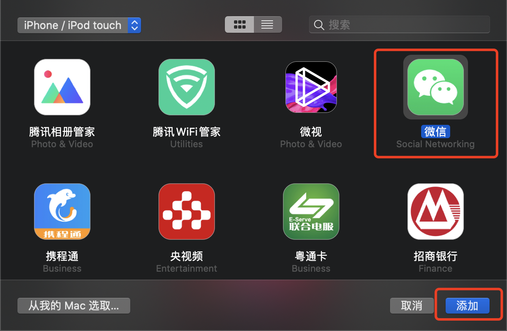

4. 点击添加后，会将该App重新添加到手机上，由于手机上已经安装了该app，此时会提示是否替换该app，先不点击任何按钮，打开一个Finder，(快捷键shift+command+G)，进入
    '~/Library/Group Containers/K36BKF7T3D.group.com.apple.configurator/Library/Caches/Assets/TemporaryItems/MobileApps/',
    就可以找到需要的资源的.ipa文件，**⚠️注意：要拷贝出去，过一会可能会消失哦**

5. 将ipa后缀修改为zip后缀后解压，进入Payload文件夹，右击.app文件，显示包内容即可显示ipa包内的所有文件

## 砸壳

从Appstrore下载的应用是经过苹果加密的ipa包，获取appstore的包之后需要解密之后才可以做自己的修改并签名安装到手机上。解密的主要操作为解密ipa包中的可执行文件(Mach-O)，俗称砸壳

### 解密应用内的可执行文件(Mach-O)

1. 打开已经越狱的iPhone手机(具体越狱方法这里就不介绍了)，进入Cydia，安装OpenSSH、Cycript这两款软件。

   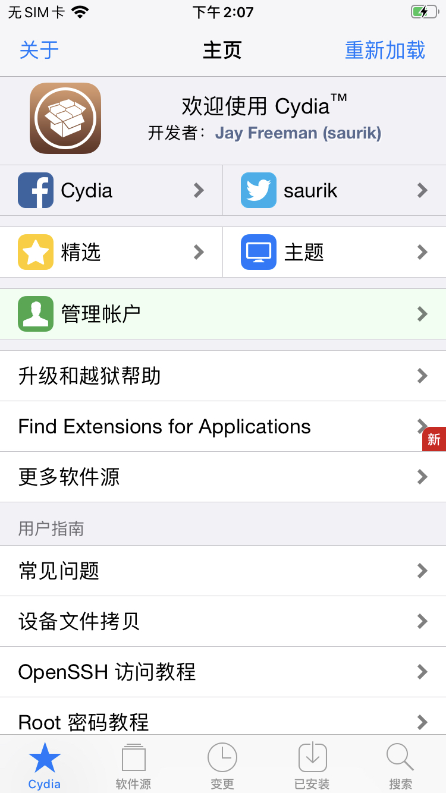

   

2. 打开Mac电脑终端，连接iPhone，用ssh进入连上的iPhone(确保iPhone和Mac在同一个网段）

   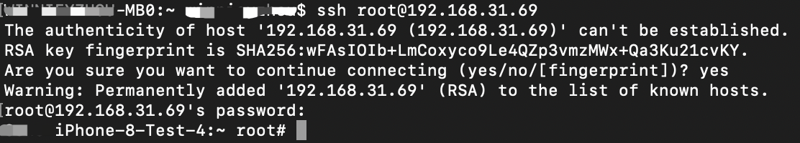

3. 获取砸壳应用的Bundle id：输入命令 ps -e，记录下此时的bundle路径

   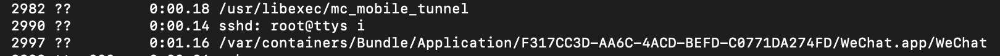

4. 用Cycript找出微信的Documents的路径，输入命令cycript -p WeChat，记录下此时的Document路径

   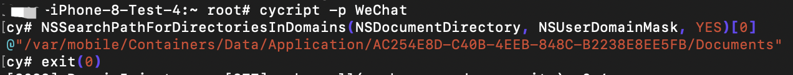

5. 编译dumpdecrypted，用dumpdecrypted来为微信二进制文件(WeChat)砸壳，确保我们从Github上下载了最新的dumpdecrypted源码，打开Mac电脑终端，进入dumpdecrypted源码的目录，编译dumpdecrypted.dylib，命令如下:

   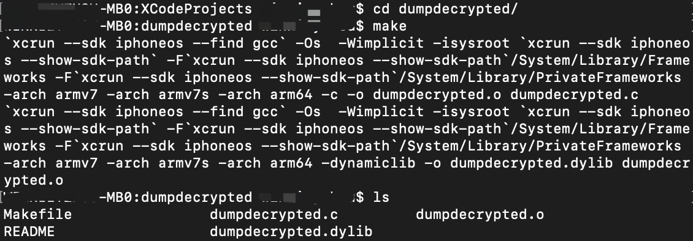

   这样我们可以看到dumpdecrypted目录下生成了一个dumpdecrypted.dylib的文件。

6. scp拷贝dumpdecrypted.dylib到iPhone上，目标路径为第4步中获取到的Document路径，这里我们用到scp命令。

   scp 源文件路径 目标文件路径 。具体如下：

   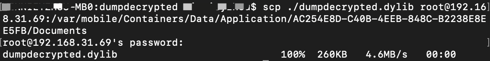

7. 开始砸壳，dumpdecrypted.dylib的具体用法是：DYLD_INSERT_LIBRARIES=/PathFrom/dumpdecrypted.dylib /PathTo

   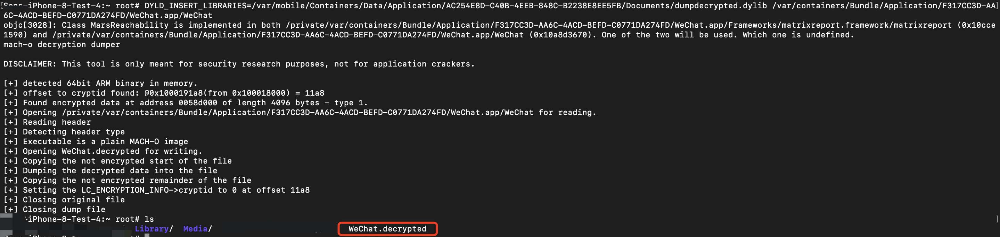

   这样就代表砸壳成功了，当前目录下会生成砸壳后的文件，即WeChat.decrypted。在Mac终端上，同样用scp命令把WeChat.decrypted文件拷贝到电脑上,接下来我们要正式的dump微信的可执行文件了。

   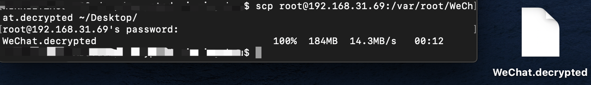
   
8. 验证是否砸壳成功，cryptid=0即为砸壳成功

   ```shell
   $ otool -l 应用名.decrypted | grep crypt
   ```

   

## 注入

### dump微信可执行文件

从Github上下载最新的class-dump源代码，然后用Xcode编译即可生成class-dump(这里比较简单，笔者就不详细说明了)。

使用class-dump命令,把刚刚砸壳后的WeChat.decrypted,导出其中的头文件。./class-dump -s -S -H ./WeChat.decrypted -o ./WeChatHeader

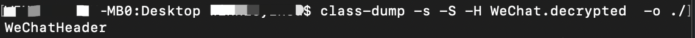

### 新建hook工程

**创建hook framework**

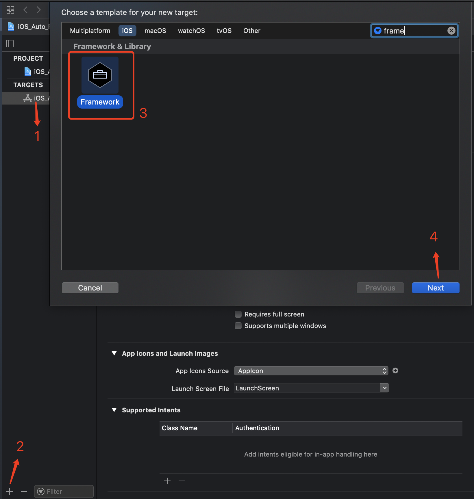

### 自动注入并重签名Framework编译环境搭建

**new group命名为APP并将已砸壳的ipa文件放入文件夹**

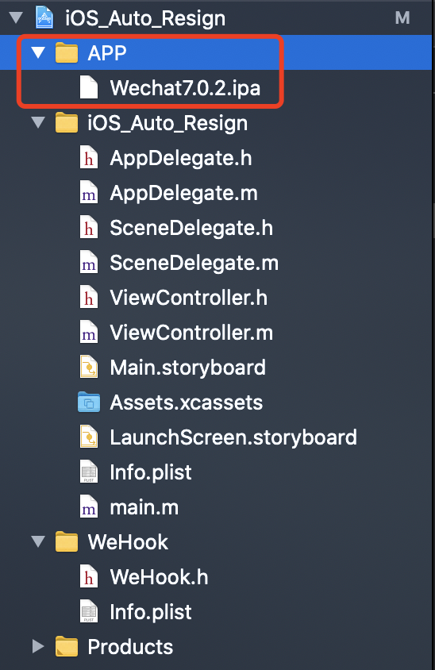

**实现Framework编译后自动copy进app包**

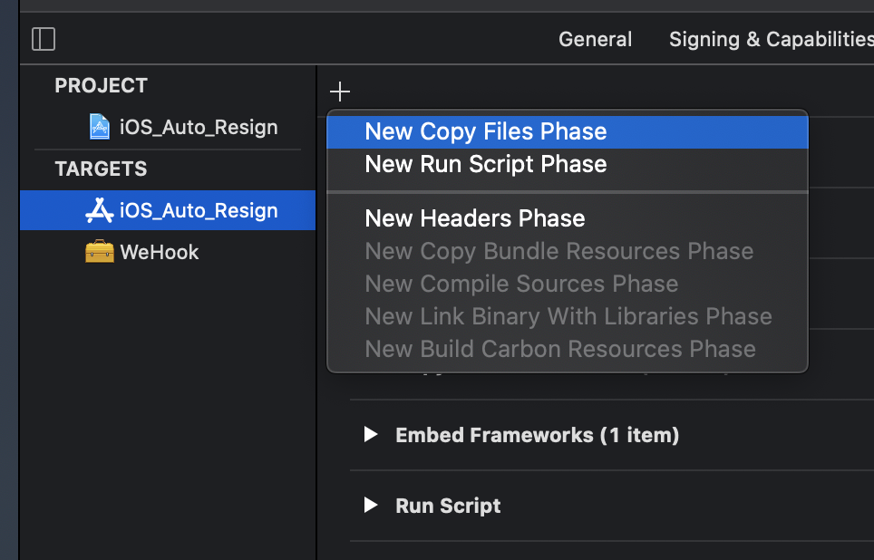

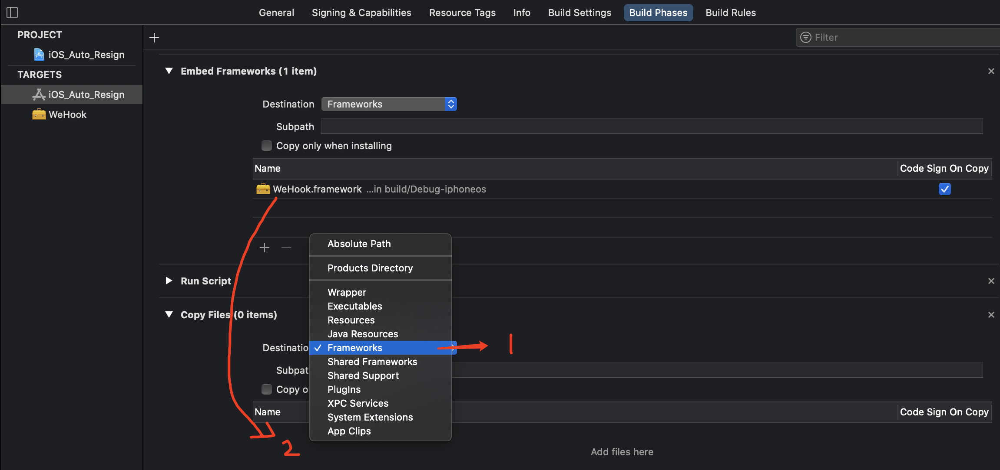

**编译yololib并将可执行文件放入系统目录下**（用于将Framework注入Mach-O文件）

获取[yololib](https://github.com/KJCracks/yololib)最新源码并编译，将Product中生成的yololib可执行文件复制到 */usr/local/bin*路径下

**添加编译脚本实现自动注入Framework及重签名**

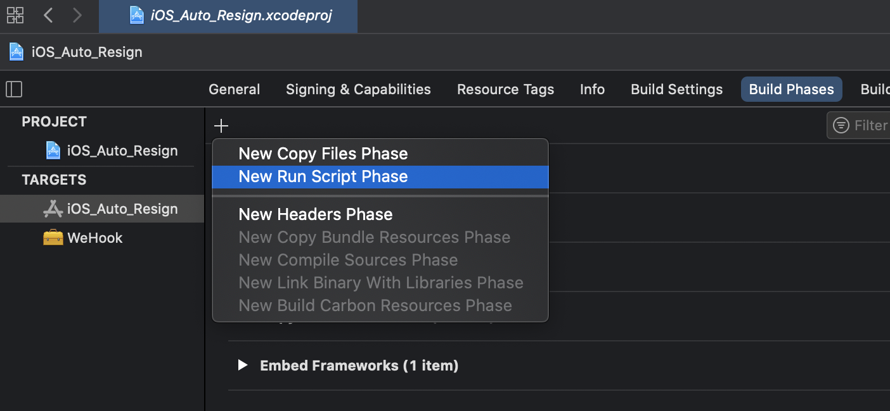

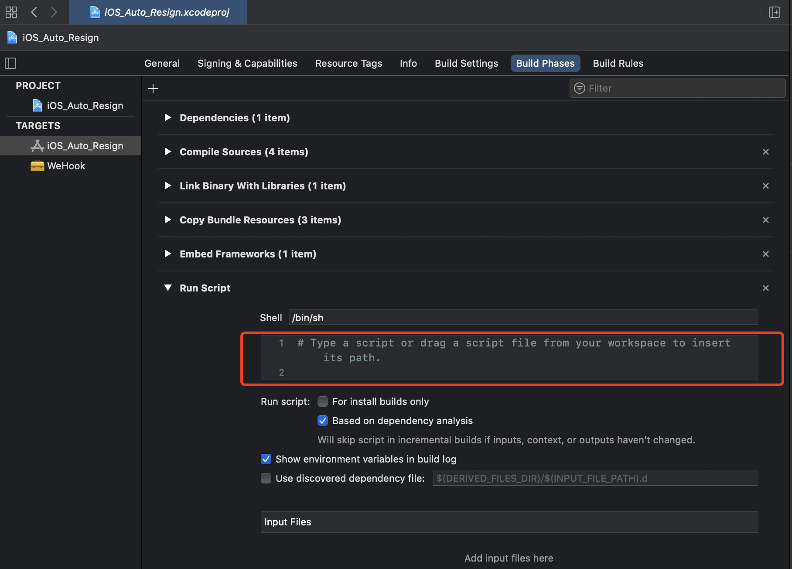

加入以下脚本代码

```shell

# ${SRCROOT} 为工程文件所在的目录
TEMP_PATH="${SRCROOT}/Temp"
#资源文件夹,放三方APP的
ASSETS_PATH="${SRCROOT}/APP"
#ipa包路径
TARGET_IPA_PATH="${ASSETS_PATH}/*.ipa"


#新建Temp文件夹
rm -rf "$TEMP_PATH"
mkdir -p "$TEMP_PATH"

# --------------------------------------
# 1. 解压IPA 到Temp下
unzip -oqq "$TARGET_IPA_PATH" -d "$TEMP_PATH"
# 拿到解压的临时APP的路径
TEMP_APP_PATH=$(set -- "$TEMP_PATH/Payload/"*.app;echo "$1")
# 这里显示打印一下 TEMP_APP_PATH变量
echo "TEMP_APP_PATH: $TEMP_APP_PATH"

# -------------------------------------
# 2. 把解压出来的.app拷贝进去
#BUILT_PRODUCTS_DIR 工程生成的APP包路径
#TARGET_NAME target名称
TARGET_APP_PATH="$BUILT_PRODUCTS_DIR/$TARGET_NAME.app"
echo "TARGET_APP_PATH: $TARGET_APP_PATH"

rm -rf "$TARGET_APP_PATH"
mkdir -p "$TARGET_APP_PATH"
cp -rf "$TEMP_APP_PATH/" "$TARGET_APP_PATH/"

# -------------------------------------
# 3. 为了是重签过程简化，移走extension和watchAPP. 此外个人免费的证书没办法签extension

echo "Removing AppExtensions"
rm -rf "$TARGET_APP_PATH/PlugIns"
rm -rf "$TARGET_APP_PATH/Watch"

# -------------------------------------
# 4. 更新 Info.plist 里的BundleId
#  设置 "Set :KEY Value" "目标文件路径.plist"
/usr/libexec/PlistBuddy -c "Set :CFBundleIdentifier $PRODUCT_BUNDLE_IDENTIFIER" "$TARGET_APP_PATH/Info.plist"

# 5.给可执行文件上权限
#添加ipa二进制的执行权限,否则xcode会告知无法运行
#这个操作是要找到第三方app包里的可执行文件名称，因为info.plist的 'Executable file' key对应的是可执行文件的名称
#我们grep 一下,然后取最后一行, 然后以cut 命令分割，取出想要的关键信息。存到APP_BINARY变量里
APP_BINARY=`plutil -convert xml1 -o - $TARGET_APP_PATH/Info.plist|grep -A1 Exec|tail -n1|cut -f2 -d\>|cut -f1 -d\<`


#这个为二进制文件加上可执行权限 +X
chmod +x "$TARGET_APP_PATH/$APP_BINARY"

#动态注入的framework，需修改为对应注入framework名称
INJECT_FRAMEWORK_PATH="Frameworks/WeHook.framework/WeHook"
yololib "$TARGET_APP_PATH/$APP_BINARY" "$INJECT_FRAMEWORK_PATH"
echo "inject success"


# -------------------------------------
# 6. 重签第三方app Frameworks下已存在的动态库
TARGET_APP_FRAMEWORKS_PATH="$TARGET_APP_PATH/Frameworks"
if [ -d "$TARGET_APP_FRAMEWORKS_PATH" ];
then
#遍历出所有动态库的路径
for FRAMEWORK in "$TARGET_APP_FRAMEWORKS_PATH/"*
do
echo "🍺🍺🍺🍺🍺🍺FRAMEWORK : $FRAMEWORK"
#签名
/usr/bin/codesign --force --sign "$EXPANDED_CODE_SIGN_IDENTITY" "$FRAMEWORK"
done
fi
```

### 编写hook代码

根据dump出来的头文件分析需要hook的功能，编写hook代码，示例如下：

1. 修改某ViewController中的某方法

   ```objective-c
   #import "MoreTableHook.h"
   #import <objc/runtime.h>
   
   @implementation MoreTableHook
   
   + (void)load
   {
       NSLog(@"hook load");
       Class origin_class  = NSClassFromString(@"MoreTableViewController");
       Class swizzed_class = [self class];
       
       SEL origin_selector = NSSelectorFromString(@"numberOfSectionsInTableView:");
       SEL swizzed_selector = NSSelectorFromString(@"new_numberOfSectionsInTableView:");
       
       Method origin_method = class_getInstanceMethod(origin_class, origin_selector);
       Method swizzed_method = class_getInstanceMethod(swizzed_class, swizzed_selector);
       
       BOOL add_method = class_addMethod(origin_class,
                                         swizzed_selector,
                                         method_getImplementation(swizzed_method),
                                         method_getTypeEncoding(swizzed_method));
       if (!add_method) {
           return;
       }
       
       swizzed_method = class_getInstanceMethod(origin_class, swizzed_selector);
       if (!swizzed_method) {
           return;
       }
       
       BOOL did_add_method = class_addMethod(origin_class,
                                             origin_selector,
                                             method_getImplementation(swizzed_method),
                                             method_getTypeEncoding(swizzed_method));
       if (did_add_method) {
           class_replaceMethod(origin_class,
                               swizzed_selector,
                               method_getImplementation(origin_method),
                               method_getTypeEncoding(origin_method));
       }else{
           method_exchangeImplementations(origin_method, swizzed_method);
       }
   }
   
   - (long long)numberOfSectionsInTableView:(id)arg1;
   {
       [self numberOfSectionsInTableView:arg1];
       return 1;
   }
   
   @end
   ```

   

2. 修改某系统类的某方法——创建category类hook原Method

   ```objective-c
   #import "UILabel+HookSetText.h"
   #import <objc/runtime.h>
   
   @implementation UILabel (HookSetText)
   
   + (void)load
   {
       Class clazz = [self class];
       
       SEL setTextSelector = @selector(setText:);
       SEL new_setTextSelector = @selector(new_setText:);
       
       Method setTextMethod = class_getInstanceMethod(clazz, setTextSelector);
       Method new_setTextMethod = class_getInstanceMethod(clazz, new_setTextSelector);
       
       BOOL did_add_method = class_addMethod(clazz,
                                             setTextSelector,
                                             method_getImplementation(new_setTextMethod),
                                             method_getTypeEncoding(new_setTextMethod));
       if (did_add_method) {
           class_replaceMethod(clazz,
                               new_setTextSelector,
                               method_getImplementation(setTextMethod),
                               method_getTypeEncoding(setTextMethod));
       }else{
           method_exchangeImplementations(setTextMethod, new_setTextMethod);
       }
       
   }
   
   - (void)new_setText:(NSString *)text
   {
       if ([text isEqualToString:@"微信"]) {
           [self new_setText:@"new_微信"];
       }else {
           [self new_setText:text];
       }
       
   }
   
   @end
   ```

## 重签名

使用本地证书对ipa进行重签名

未完待续。。。

## 参考资料

[iOS逆向之自动化重签名](https://www.jianshu.com/p/30c1059879aa)

[一步一步实现iOS微信自动抢红包(非越狱)](https://www.yinxiang.com/everhub/note/20b93ceb-8a6d-44f0-96fa-85bd8ba25abe)

[iOS逆向之代码注入(framework)](https://www.cnblogs.com/WinJayQ/p/9032739.html)

